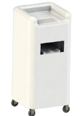

# Artificial Intelligence System for Assessing Handwashing Using Phosphor Gel

<p align="center">
  
</p>

## 📌 Project Overview
This project focuses on developing an **AI-powered hand hygiene assessment system** using **image processing**. The system evaluates handwashing effectiveness based on fluorescence gel and UV light analysis.

## 🔥 Features
- **Automated hand hygiene evaluation** using **OpenCV and MediaPipe**  
- **AI-powered scoring system** to assess cleanliness  
- **Real-time image processing** with **Raspberry Pi 5**  
- **User-friendly GUI** built with **PyQt6**  
- **Data storage and retrieval** using **SQLite**  

## 🛠️ Technologies Used
- **Programming Language:** Python  
- **Front-end:** PyQt6  
- **Back-end:** OpenCV, MediaPipe  
- **Database:** SQLite  
- **Hardware:** Raspberry Pi 5  

## 📊 System Workflow
1. **User applies phosphor gel and washes hands**  
2. **Hands are scanned under UV light**  
3. **AI analyzes fluorescence intensity to detect unclean areas**  
4. **System assigns a cleanliness score**  
5. **Results are stored in the database for review** 

## 🔍 Research Contribution
This project was developed as part of a senior thesis at Thammasat University, in collaboration with the Research Center for Robotics and Vibration

## 🚀 Installation & Usage
### **1. Clone the repository**
```sh
git clone https://github.com/RawichSinghachai/senior_project.git
```
### **2. Install dependencies**
```sh
cd senior_project
python -m venv env
# For Windows
env\Scripts\activate
# For macOS/Linux
source env/bin/activate
pip install -r requirements.txt
```

### **3. Run the Application**
```sh
python main.py
```
## **Demo Application**


